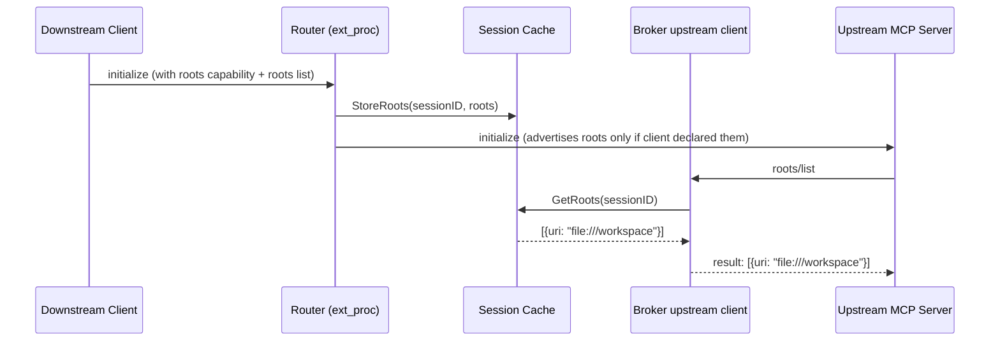

# MCP Roots Support

## Problem

The gateway declares the `roots` capability in every upstream `initialize` handshake (`internal/broker/upstream/mcp.go` line 118) but there's nothing behind it. If an upstream server sends a `roots/list` request, the gateway has no way to respond — the roots the downstream client declared at `initialize` time are never stored anywhere. So the capability is advertised but broken.

## Summary

Store the roots from the downstream client's `initialize` params in the session cache, and wire up a `roots/list` handler on the upstream broker client that reads them back. The gateway stays transparent — it doesn't generate or interpret roots, just holds them for the session and returns them when upstream asks.

## Goals

- Store roots from downstream `initialize` in the session cache (keyed by session ID)
- Handle `roots/list` from upstream servers using those stored roots
- Only advertise the `roots` capability to upstream when the downstream client actually declared it
- Clean up on session end

## Non-Goals

- `notifications/roots/list_changed` — deferred, depends on notifications design
- Roots-based access control — belongs in AccessPolicy, not here

## Job Stories

### When an upstream server queries roots on startup

When a platform engineer deploys a code analysis MCP server behind the gateway that calls `roots/list` during initialisation to scope itself to the client's workspace, they want the gateway to return whatever roots the client declared rather than timing out or returning an empty list, so the upstream server starts up cleanly without needing to know a gateway is in the path.

### When the downstream client doesn't declare roots

When a client sends `initialize` without a `roots` capability, the gateway shouldn't advertise roots to upstream at all, so upstream servers that skip `roots/list` when the capability is absent don't get unexpected behaviour.

## Design

### Does Roots make sense for an HTTP gateway?

The spec is written with stdio and local editors in mind, but HTTP clients can declare roots too. The gateway's job here is to be transparent — if the client says it has roots, upstream should be able to see them. Right now we advertise the capability and then can't back it up, which is worse than not advertising it. This fixes that.

### Flow



### Component Responsibilities

| Component | Responsibility |
|---|---|
| Router (`request_handlers.go`) | Extract roots from downstream `initialize`, call `StoreRoots` on session cache |
| Session Cache | Add `StoreRoots` / `GetRoots`, clean up in `DeleteSessions` |
| Broker upstream client (`mcp.go`) | Register `WithRootsHandler` that reads from session cache; only advertise `roots` cap if client declared it |

### API Changes

No CRD changes. Roots are ephemeral session data — same pattern as existing session state.

### Data Storage

In-memory session cache, keyed by gateway session ID. Cleaned up with the rest of the session on disconnect. A root entry looks like:

```go
type RootEntry struct {
    URI  string `json:"uri"`
    Name string `json:"name,omitempty"`
}
```

### Security Considerations

Roots are per-session — one client's roots are never visible to another. Root URIs are relayed verbatim without validation.

### Relationship to Existing Approaches

The elicitation implementation is the closest precedent — also a server-initiated flow back to the client. The difference is roots are pull-based (upstream asks on demand via `roots/list`) rather than the push model elicitation uses.

### Future Considerations

`notifications/roots/list_changed` — if a client wants to update roots mid-session, the gateway would need to push that to upstream. Leaving this for when the notifications design is done.

## Execution

- [Implementation plan](tasks/tasks.md)
- [E2E test cases](tasks/e2e_test_cases.md)
